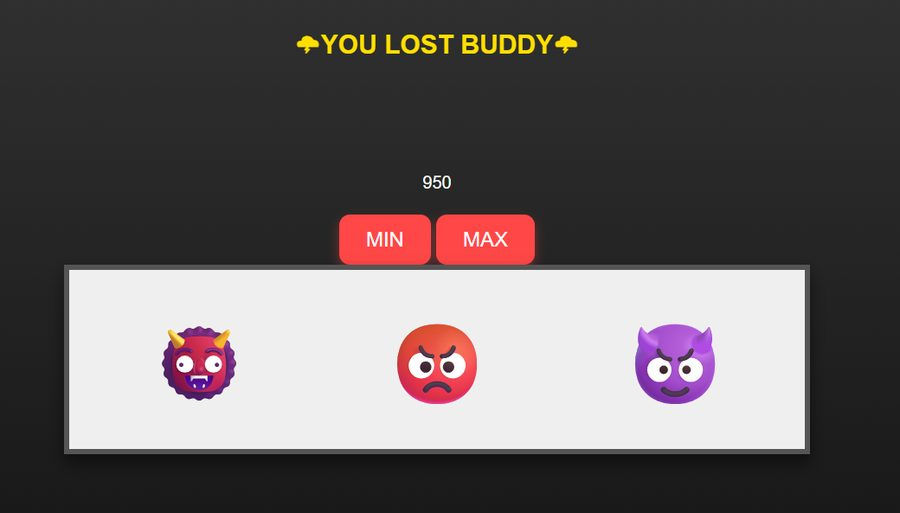

# Slot Machine

A slot machine that starts you with $1000 of house money. MIN bets $5, MAX bets $50, three emoji reels spin, and three of a kind pays your bet times 1000. Generous? Absurdly. Fun? Yes.

## How the code works

It all runs through `spin(bet)`. Click MIN or MAX and the button calls `spin(5)` or `spin(50)`. The ordering inside is the whole game, and it's the part I was most careful about: first it checks you can cover the bet, and if not you get a blunt "YOU BROKE". Otherwise it subtracts the bet, picks three random symbols from the emoji array with `Math.random()`, and writes them into the three reel elements. If all three match, your balance jumps by `bet * 1000` and the win message shows; anything else is a loss message. The money display updates dead last, every spin.

Why that order matters: subtract, resolve, add, render. If the display ever updated before the math settled, the balance would drift from reality after a few rounds, and a money bug is the one bug a slot machine can't have. Keeping all the state transitions in one function instead of scattered across handlers is what makes that ordering enforceable.

The hardest part was keeping the money honest. Simple arithmetic, but the sequence has to be exact or the whole thing quietly lies to the player.

Built with HTML, CSS, and vanilla JavaScript. My code is on the `answer` branch.
